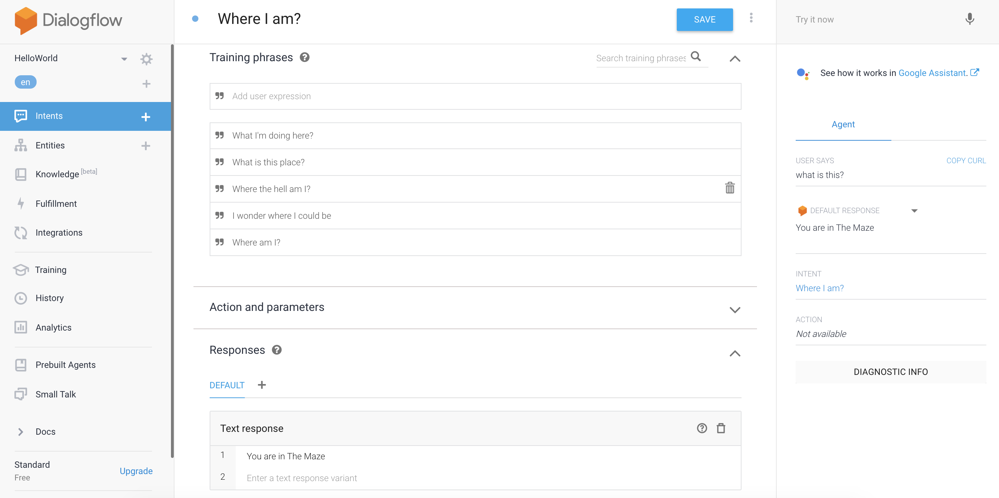
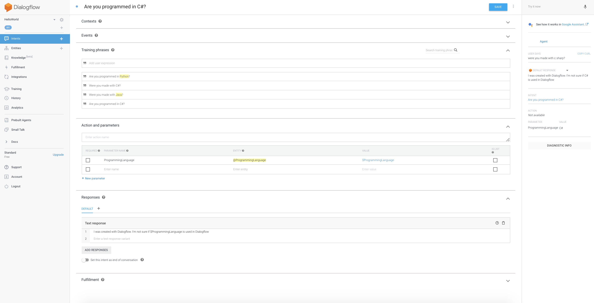
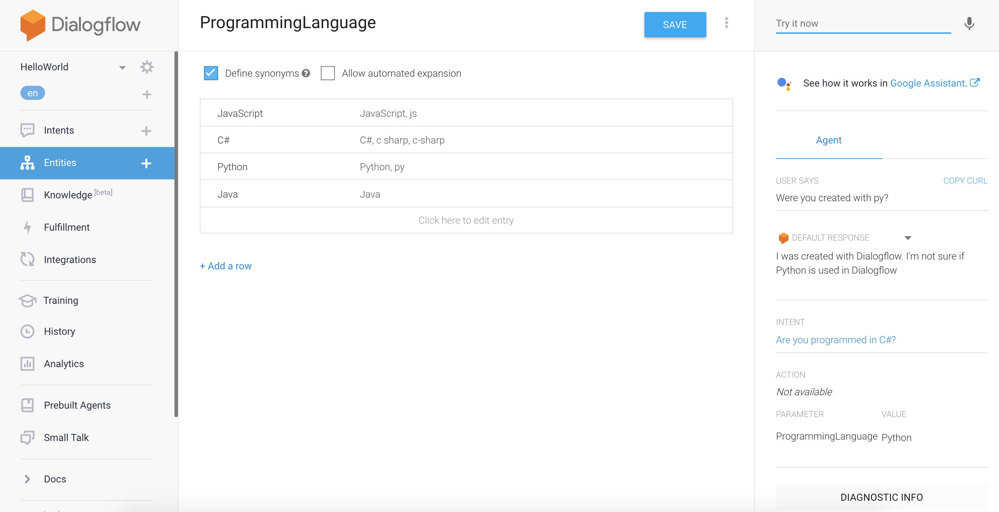
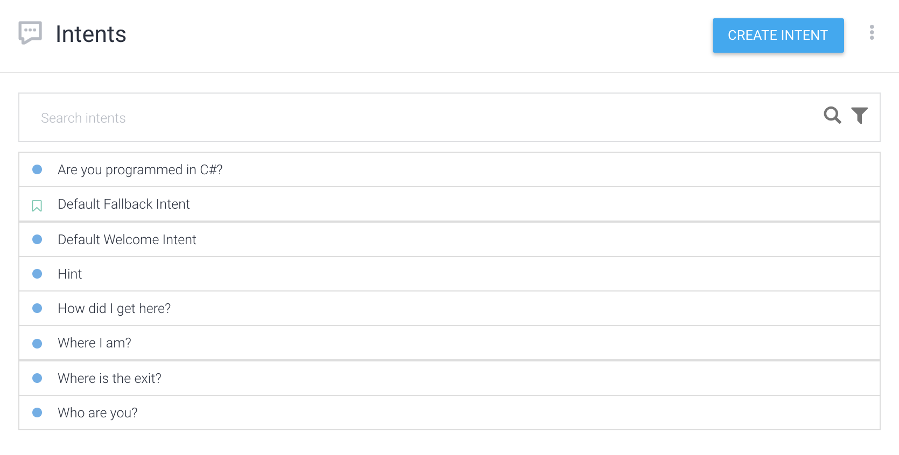

# Simple Chatbot example in Dialogflow

Showing the phrases used to train for answering the player where is she/he. And
showing also what the chatbot answers to the question "what is this?". Note that
that __exact question wasn't given to the bot as training data__

The following screenshot Shows an intent where the user asks for whether the
chatbot was programmed in a certain language and __the chatbot answers using the
name of the language inputted__. The screenshot also shows the chatbot answering
"were you made with c sharp?" with "I was created with Dialogflow. I'm not sure
if C# is used in Dialogflow"

Next is a screenshot showing the `ProgrammingLanguage` entity, definining __what
should the chatbot understand as a programming language and synonims for each
language__ defined. It also shows the chatbot answering the question "Where you
created with py?" and answering "I was created with Dialogflow. I'm not sure if
Python is used in Dialogflow"

The last screenshot shows the list of all the names of the intents created for
this task. The titles were selected so they represent the __general question
that was given to the chatbot to train__

